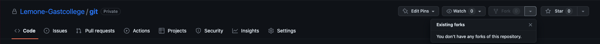

# Git workshop

## Opdracht 1: maak een account aan op GitHub

Ga naar de volgende link en registeer jouw account als je deze nog niet hebt.
https://github.com/join

_Heb je al wel een account, kan je deze stap overslaan, log dan in op jouw account._

 

## Fork het project

https://github.com/Lemone-Gastcollege/git

### [Installeer Git op je lokale machine](./install_git.md)